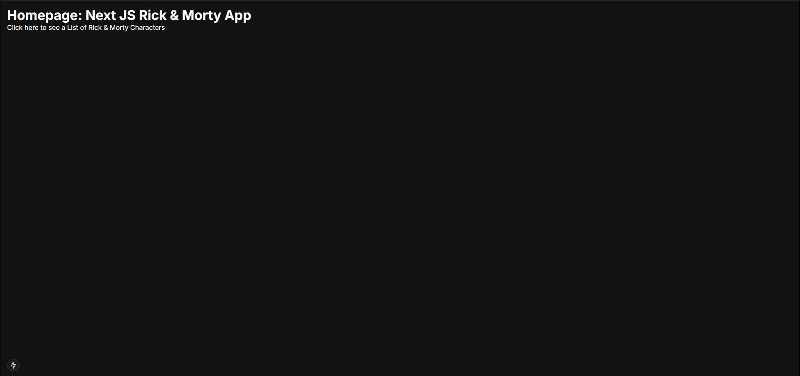

# Welcome to Rick And Morty App :wave:

## Description
Thanks to visit my Github! In this project, i used Typescript. This project is created with NEXTJS, TAILWIND, TS. 
Project aims to create a Rick And Morty App. 

## Output

### At the end of the project, following topics are to be covered;

-  NEXTJS

-  TAILWIND

-  TS

### Got feedback for me?

Feedbacks are always improve my technical knowledge, so feel free to give me a feedback through my LinkedIn account (https://www.linkedin.com/in/burakkturk) 🙌

This Is What I Did! :art:

